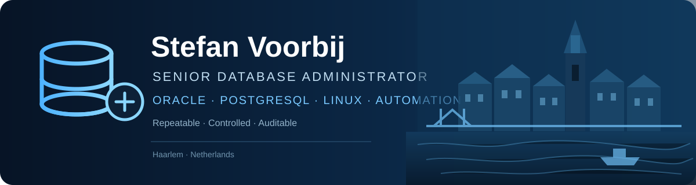

  

## Hi, I'm Stefan 👋

I'm a **Senior Database Administrator** working with Oracle, PostgreSQL and Linux.

My main interest is turning operational database work into processes that are **repeatable, controlled and auditable** — especially around patching, migrations, security and automation.

### 🔧 What I work with

- **Oracle Database** — 19c, RAC, ASM, Enterprise Manager
- **PostgreSQL** — administration, migrations and performance
- **Oracle Linux**
- **Automation** — Shell, Python, Ansible and AWX
- **Security & compliance** — OpenSCAP / STIG
- **Database patching** — validation, approval flows and evidence

### 🚀 Featured projects

#### [Oracle Patch Guard](https://github.com/stefanv2/oracle-patch-guard)
A controlled, approval-driven framework for Oracle Database patching.

`PRECHECK → PLAN → APPROVE → APPLY`

Highlights:
- validated local patch media
- cryptographic approval and integrity checks
- fail-closed execution
- multi-target and OEM integration
- regression testing and audit evidence

#### [OpenSCAP STIG Compliance Dashboard](https://github.com/stefanv2/oscap)
Reporting and dashboard tooling for OpenSCAP and STIG compliance on Oracle Linux.

#### [PostgreSQL 11 → 16 migration](https://github.com/stefanv2/PG11toPG16)
Notes and tooling around PostgreSQL migration from version 11 to 16, including Oracle Linux platform migration.

### 🧭 Current focus

`Oracle patching` · `PostgreSQL` · `Linux security` · `Ansible` · `OEM` · `automation` · `AI-assisted operations`

---

  Databases · Automation · Reliability · Continuous improvement

